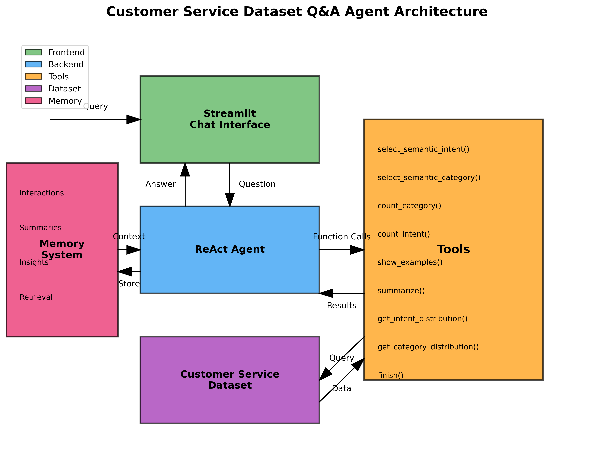

# Customer Service Dataset Q&A Agent

This application provides a chat interface for querying and analyzing the Bitext - Customer Service Tagged Training dataset using a ReAct agent.

## Architecture

The application consists of:

1. **Frontend**: Streamlit chat interface
2. **Backend**: ReAct agent with function calling capabilities
3. **Tools**: Functions to query and analyze the dataset
4. **Dataset**: Bitext - Customer Service Tagged Training dataset
5. **Memory**: Persistent memory system for tracking and analyzing interactions



## Features

- Answer structured questions about the dataset (categories, intents, distributions)
- Provide unstructured analysis (summaries, insights)
- Handle follow-up questions
- Toggle between planning modes:
  - Pre-planning + Execution: Plan first, then execute
  - ReActive Dynamic Planning: Plan and execute dynamically
- Memory system:
  - Store and retrieve past interactions
  - Summarize interaction patterns
  - Use relevant past information to improve responses

## Question Types

The agent can handle three main categories of questions:

1. **Structured**:
   - What are the most frequent categories?
   - Show examples of Category X
   - What categories exist?
   - Show intent distributions

2. **Unstructured**:
   - Summarize Category X
   - Summarize how agents respond to Intent Y

3. **Out-of-scope**:
   - Questions not related to the dataset (politely declined)

## Dataset

The application uses the [Bitext - Customer Service Tagged Training dataset](https://huggingface.co/datasets/bitext/Bitext-customer-support-llm-chatbot-training-dataset) from Hugging Face, which contains:

- 26,872 customer service conversations
- Each conversation has:
  - Customer instruction/query
  - Agent response
  - Intent label
  - Category label
  - Flags

## Memory System

The agent includes a memory system that:

1. **Stores interactions**: Records all user queries, agent responses, and tools used
2. **Retrieves relevant information**: Finds past interactions relevant to the current query
3. **Summarizes patterns**: Generates summaries of interaction patterns and insights
4. **Improves responses**: Uses past interactions to provide more consistent and informed answers

## Setup and Installation

1. Clone the repository:
```bash
git clone https://github.com/yourusername/agent_analyst.git
cd agent_analyst
```

2. Install dependencies:
```bash
pip install -r requirements.txt
```

3. Set up your OpenAI API key:
```bash
export OPENAI_API_KEY=your_api_key_here
```

4. Run the application:
```bash
streamlit run agent_analyst/app/app.py
```

## Example Usage

Example question: "How many refund requests did we get?"

The agent will:
1. Check memory for relevant past interactions
2. Call `select_semantic_intent(['get_refund'])`
3. Count the results
4. Return the answer
5. Store the interaction in memory

## Tools

The agent has access to the following tools:

- `select_semantic_intent([intent_name])`: Select conversations with specific intents
- `select_semantic_category([category_name])`: Select conversations with specific categories
- `sum(a, b)`: Add two numbers
- `count_category(category)`: Count conversations in a category
- `count_intent(intent)`: Count conversations with an intent
- `show_examples(n)`: Show n example conversations
- `summarize(user_request)`: Generate a summary based on the user request using LLM
- `get_intent_distribution(top_n)`: Get the distribution of intents
- `get_category_distribution(top_n)`: Get the distribution of categories
- `finish()`: Return the final answer
